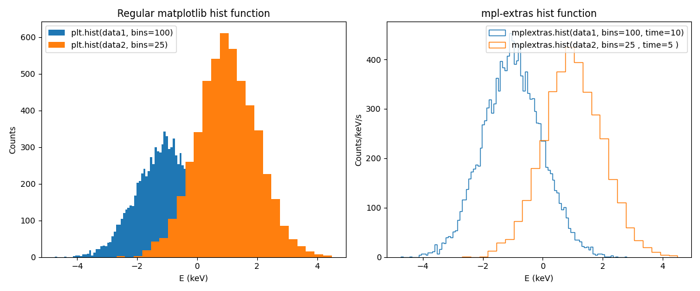
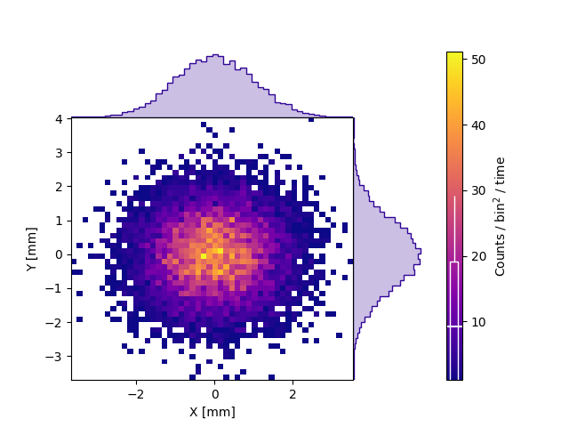

# [mpl-extras](https://github.com/AlvaroEzq/mpl-extras) 🐍
A minimal python package that contains some common matplotlib.pyplot plotting functions but with extra capabilities that I found useful myself.

For instance, if one has two datasets such as:
```python
data1 = numpy.random.normal(-1, 1, 10000)
data2 = numpy.random.normal( 1, 1, 5000)
```
[](docs/mpl_vs_mplextras.png)

Or you can easily add marginals to 2d histograms
[](docs/hist2d.png)

## Installation ⚙️
This package is currently not available at PyPi, so the installation requieres to download the source code from this repository. To do so, follow these steps:

1️⃣ Download this github repository

```bash
git clone https://github.com/AlvaroEzq/mpl-extras
```
2️⃣ Change directory to this repository folder
```bash
cd mpl-extras
```
3️⃣ Install the package
```bash
pip install .
```
or
```bash
pip install -e .
```
if you want to edit and develope your own mpl-extra function.

## Getting Started 👨‍💻
Run the simple [example](examples/example.py):
```bash
cd examples
python example.py
```